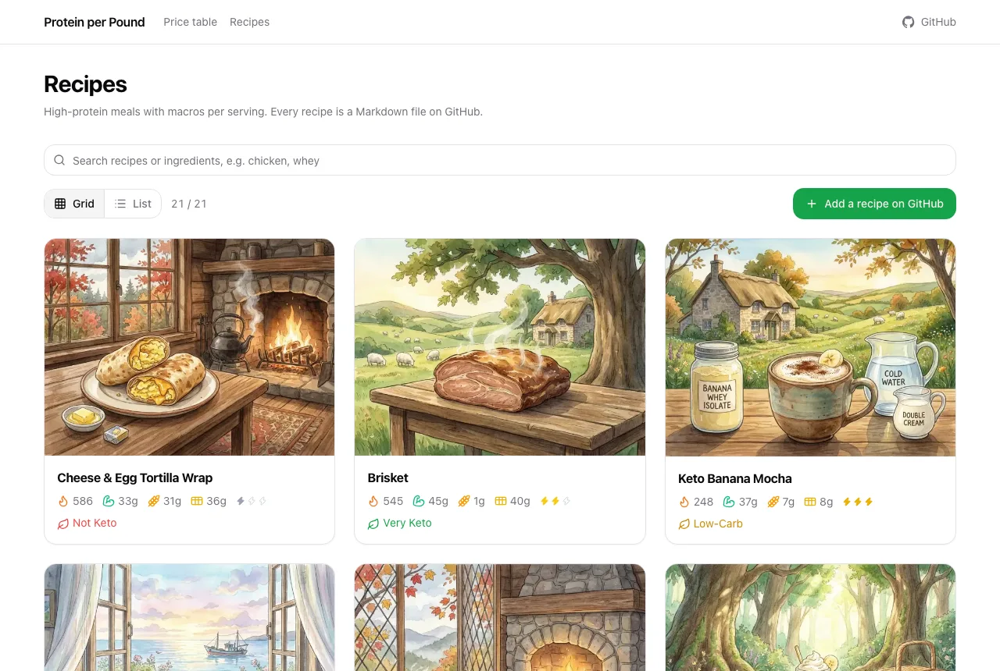
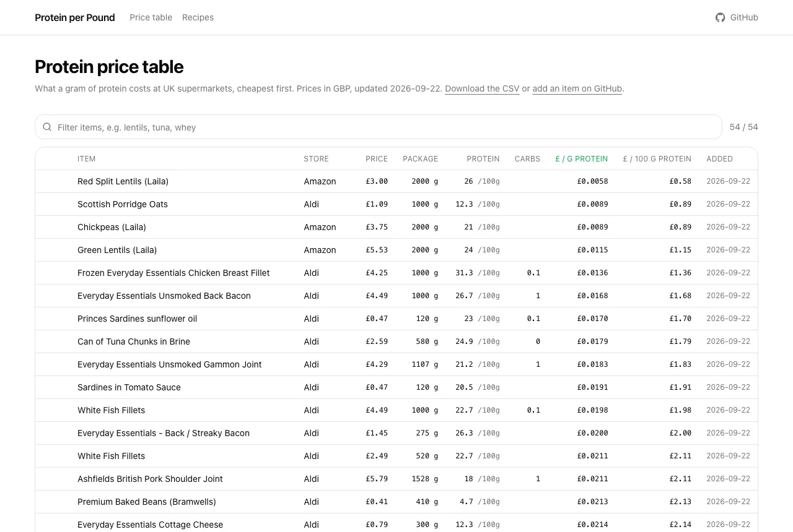
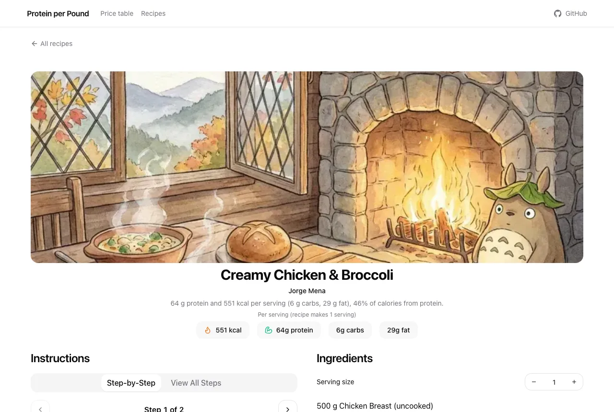

<div align="center">

# Protein per Pound

**Cheap protein, ranked by what a gram actually costs, plus high-protein recipes to cook with it.**

[](https://github.com/JorgeMenaDev/protein-per-pound/actions/workflows/check.yml)
[](LICENSE)
[](CONTRIBUTING.md)

[Website](https://protein-per-pound.vercel.app) · [Price table](https://protein-per-pound.vercel.app/table) · [Recipes](https://protein-per-pound.vercel.app/recipes) · [Contributing](CONTRIBUTING.md)



</div>

## What it is

When the table launched, red split lentils cost £0.58 per 100 g of protein and frozen chicken breast £1.36. Both look cheap per kilo, yet the lentils give more than twice the protein for the same money. Protein per Pound makes that visible.

- **Price table.** UK supermarket foods ranked by the price of one gram of protein, from shelf prices and nutrition labels.
- **Recipes.** High-protein meals with calories, protein, carbs and fat per serving, a step-by-step view and a serving scaler.

Everything on the site comes from plain files in this repo: one CSV for the table and one Markdown file per recipe. The site only reads them. There are no accounts and no database, and every change is a pull request anyone can review.

<table>
  <tr>
    <td></td>
    <td></td>
  </tr>
</table>

## Contribute in five minutes

You do not need to know Git.

- **Tell us.** Open an issue with the [new food](https://github.com/JorgeMenaDev/protein-per-pound/issues/new?template=add-food.yml), [new recipe](https://github.com/JorgeMenaDev/protein-per-pound/issues/new?template=add-recipe.yml) or [fix a number](https://github.com/JorgeMenaDev/protein-per-pound/issues/new?template=fix-data.yml) form and a maintainer turns it into a pull request.
- **Edit on GitHub.** Open [`data/protein-sources.csv`](data/protein-sources.csv) or any file in [`recipes/`](recipes), press the pencil, and GitHub opens the pull request for you. Every recipe page on the site has a "Suggest an edit" button that does this.
- **Work locally.** `git clone`, `bun install`, `bun run check`, `bun run dev`.

Good places to start: the recipes that have no steps yet, and prices from shops the table does not cover. [CONTRIBUTING.md](CONTRIBUTING.md) has the full guide, including the one rule that matters most: only add numbers you can prove.

## Adding a food

Everything lives in [`data/protein-sources.csv`](data/protein-sources.csv), one row per product and package size. Prices are GBP from UK shops.

| column | meaning |
| --- | --- |
| name | product name |
| store | where the price was seen |
| price_gbp | price of one package |
| package_size | how much one package contains |
| package_unit | `g`, `ml`, or `piece` |
| protein_per_100g | grams of protein per 100 g (or 100 ml) |
| protein_per_piece | grams of protein per piece, for `piece` packages |
| carbs_per_100g | grams of carbs per 100 g, when known |
| price_per_g_protein | derived: cost of one gram of protein |
| price_per_100g_protein | derived: cost of 100 g of protein |
| date_added | date the row entered this table (YYYY-MM-DD) |
| image_url | optional URL of a product photo, shown as a thumbnail that opens full screen |

Fill in name, store, price_gbp, package_size, package_unit, and protein_per_100g (or protein_per_piece for piece packages), plus date_added. The derived columns can stay blank; the site computes them with this formula:

```
total_protein = package_size * protein_per_100g / 100        # g or ml packages
total_protein = package_size * protein_per_piece             # piece packages
price_per_g_protein = price_gbp / total_protein
price_per_100g_protein = price_per_g_protein * 100
```

Keep one row per product and package size. `image_url` is optional; any stable URL to a product photo works (longest edge around 1600 px).

## Adding a recipe

Add two files to [`recipes/`](recipes): `your-recipe.md` and, optionally, a photo `your-recipe.webp` (or `.jpg`/`.png`, around 800×600, under 300 KB). The file name becomes the page address, so use lowercase words joined by hyphens.

```markdown
---
name: "Chicken Fajitas"
author: "Your Name"
cook_time: "4 hours"          # optional
servings: 2
macros:                       # totals for the whole recipe, not per serving
  calories: 570
  protein: 74
  carbs: 45
  fat: 12
ingredients:
  - name: "Chicken breast"
    amount: 300
    unit: "g"
  - name: "Red pepper, cut into strips"
    amount: 1
    unit: "whole"
tags: ["slow-cooker", "high-protein"]
image: chicken-fajitas.webp   # optional, a file next to this one
created: 2026-09-22
---

## Instructions

1. Put the peppers in the slow cooker and lay the chicken on top.
2. Cook on high for 2 hours or low for 4, then slice the chicken.

## Notes

- Frozen chicken works too; give it longer.
```

The rules the check enforces:

- `name`, `author`, `servings`, `macros` (all four numbers), at least one ingredient, and `created` are required. `amount` is a number; the site divides macros by `servings` and scales ingredient amounts when someone changes the serving size.
- The body may only contain `## Instructions` (a numbered list, one step per line) and `## Notes` (a bullet list). Both are optional.
- `image` must name a file that exists in `recipes/`.

Run the check locally with `bun install && bun run check`. The same check runs on every pull request.

## Use the data

The data is MIT-licensed. Use it in your own apps, spreadsheets or research.

- [`/data/protein-sources.csv`](https://protein-per-pound.vercel.app/data/protein-sources.csv): the price table.
- [`/llms.txt`](https://protein-per-pound.vercel.app/llms.txt) and [`/llms-full.txt`](https://protein-per-pound.vercel.app/llms-full.txt): an index and a single Markdown file with the full table and every recipe, for LLMs and agents.
- Every page carries schema.org JSON-LD (`Recipe`, `Dataset`, `ItemList`, `BreadcrumbList`), and [`/sitemap.xml`](https://protein-per-pound.vercel.app/sitemap.xml) lists every recipe with its photo.

## Run it locally

Needs [Bun](https://bun.sh).

```
bun install
bun run dev      # http://localhost:3000
bun run check    # validate the CSV and every recipe
bun run build    # check + production build
```

```
data/protein-sources.csv      the price table
recipes/<slug>.md, .webp      one recipe and its photo
scripts/check.ts              the validator CI runs on every pull request
src/lib/recipes.ts            the recipe schema (zod) and Markdown parser
src/lib/seo.ts                titles, descriptions and JSON-LD
src/app/                      Next.js 15 pages, sitemap, robots, llms.txt, social images
```

Built with Next.js, Tailwind CSS, Radix UI and lucide icons. Pushes to `main` deploy to Vercel.

## Where it came from

Protein per Pound started as two features of Fitbite, a food tracking app. On 2026-09-22 the price table was extracted from Fitbite's databases, merged with its seed list, and opened up here. The first 21 recipes are Jorge Mena's own, exported the same day, with obvious typos in names fixed.

## License

[MIT](LICENSE). The code and the data are free to use, change and share.
